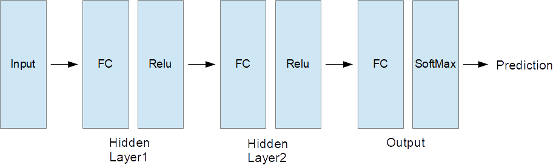

# Neural Network from Scratch
In this repository, I will show you the example code of the scratch implementation of the neural network. The theories about neural network are described in [c231n (Stanford Univ.)](http://cs231n.github.io/). The details of the backpropagation are described in [Neural Networks and Deep Learning](http://neuralnetworksanddeeplearning.com/chap2.html).

## 1. Environments
- numpy 1.14.5
- pandas 0.23.1
- matplotlib 2.2.2
- scikit-learn 0.19.1

## 2. Preparation
- Download [MNIST dataset](http://yann.lecun.com/exdb/mnist/) (4 files) and store those files into the "data" directory.
- Required file names are following:
  - train-images-idx3-ubyte.gz
  - train-labels-idx1-ubyte.gz
  - t10k-images-idx3-ubyte.gz
  - t10k-labels-idx1-ubyte.gz

## 3. What I have created
What I have created is the network for the digit recognition (MNIST Dataset). The network structure is shown in the following figure.



## 4. Execution of the program
```
python train.py
```
To simplify the execution, hyper parameters of the network have already pre-defined in the code.

__Note of the program:__
- All the digits data including the test data are normalized by 255.
- Split original training dataset into train & validation data.  
  - training : validation = 0.8 : 0.2
- Keep training until the validation loss reaches to plateau.
  - Save weights and biases as ".npy" format only in case the validation loss improved.
- Load best model and evaluate model using test dataset.

## 5. Details of the computation theories
[Check here !](explanation.ipynb)
