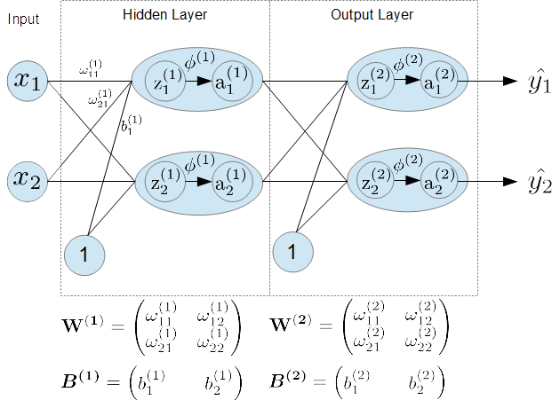

# Neural Network from Scratch
In this "gist" repo., I will show you the example code of the scratch implementation of the neural network. The theories about neural network are described in [c231n (Stanford Univ.)](http://cs231n.github.io/). The details of the backpropagation are described in [Neural Networks and Deep Learning](http://neuralnetworksanddeeplearning.com/chap2.html).

## 1. Environments
- numpy 1.14.5
- matplotlib 2.2.2

## 2. Preparation
- Download [MNIST](http://yann.lecun.com/exdb/mnist/) dataset (4 files) and store those files to the "data" directory.

## 3. Execution
\- training
```
python neuralnet.py train
```
- Load training dataset.
- Split original training dataset into train & validation data.
- Train until the validation loss reaches to plateau.
- Save weights and biases in ".npy" format.

\- test
```
python neuralnet.py test
```
- Load test dataset.
- Load stored weights and biases.
- Execute inference and show results.

## 4. What I create
The network for the digit recognition (MNIST Dataset).

- Layer Structure


## 5. Very simplified explanation about the computation
In this section, I will summarize the computation of the neural network.
For simplification, the network structure for the description is much simpler than the network described above.

### 5.1 Example Structure
Two layer perceptron: [INPUT] - [FC(HIDDEN1)] - [FC(OUTPUT)]  
Input: $X=(x_1, x_2)$  
Output: $\hat{y} = (\hat{y_1}, \hat{y_2})$  

The detailed structure is shown in the figure below.  



Definition:
- $z_j^{(l)}$: input to the neuron $j$ of the layer $l$
- $\phi^{(l)}$: activation function of the layer $l$
- $a_j^{(l)}$: output of the nuuron $j$ of the layer $l$  
- $\bf{W}$: weight matrix
- $\bf{B}$: bias vector

### 5.2 Forward pass
```python
# Input -> hidden
z_1 = np.dot(X, W_1) + b_1
a_1 = phi_1(z_1)

# hidden -> Output
z_2 = np.dot(X, W_1) + b_2
y_hat = phi_2(z_2)  # y_hat = a_2 = phi_2(z_2)
```

### 5.3 Parameter updates (SGD)
- Update weights and bias to minimize the prediction error.
- Prediction error is calculated bye loss function (error function).

In case of using SGD, the update rules are following.

#### - Weight
$$\bf{W^{(i)}} \to \bf{W^{(i)}}+\Delta{\bf{W^{(i)}}}$$
$$\Delta{\bf{W^{(i)}}} = -\eta\frac{\partial L}{\partial \bf{W^{(i)}}}$$

#### - Bias
$$\bf{B^{(i)}} \to \bf{B^{(i)}}+\Delta{\bf{B^{(i)}}}$$
$$\Delta{\bf{B^{(i)}}} = -\eta\frac{\partial L}{\partial \bf{B^{(i)}}}$$

### 5.4 Backpropagation
#### 5.4.1 Objective
To calculate the partial derivative of the loss function using chain rule.

#### 5.4.2 Details


##### 1) Output Layer (layer 2)
\- Error term of the output Layer
- Subscript "j" indicates the neuron number of the layer (2).
$$
\begin{align*}
  \delta_j^{(2)}
  &= \frac{\partial L}{\partial z_j^{(2)}}
  = \frac{\partial L}{\partial \hat{y_j}} \frac{\partial \hat{y_j}}{\partial z_j^{(2)}}
  = \frac{\partial L}{\partial \hat{y_j}} \frac{\partial a_j^{(2)}}{\partial z_j^{(2)}} \\
  &= \frac{\partial L}{\partial \hat{y_j}} \frac{\partial \phi^{(2)}(z_j^{(2)})}{\partial z_j^{(2)}}
  = \frac{\partial L}{\partial \hat{y_j}} \phi'^{(2)}(z_j^{(2)})
\end{align*}
$$

\- Partial derivative of the weights/bias in the output Layer
- weights
  - Subscript "j" indicates the neuron number of the layer (2).
  - Subscript "k" indicates the neuron number of the layer (1).
$$
\begin{align*}
  \frac{\partial L}{\partial \omega^{(2)}_{k,j}}
  &= \frac{\partial L}{\partial \hat{y_j}} \frac{\partial \hat{y_j}}{\partial \omega^{(2)}_{k,j}}
  = \frac{\partial L}{\partial \hat{y_j}} \frac{\partial a_j^{(2)}}{\partial \omega^{(2)}_{k,j}}
  = \frac{\partial L}{\partial \hat{y_j}} \frac{\partial  \phi^{(2)}(z_j^{(2)})}{\partial \omega^{(2)}_{k,j}} \\
  &= \frac{\partial L}{\partial \hat{y_j}} \frac{\partial  \phi^{(2)}(z_j^{(2)})}{\partial z_j^{(2)}} \frac{\partial z_j^{(2)}}{\partial \omega^{(2)}_{k,j}}
  = \frac{\partial L}{\partial \hat{y_j}} \phi'^{(2)}(z_j^{(2)}) \cdot a^{(1)}_k \\
  &= \delta_j^{(2)} a^{(1)}_k
\end{align*}
$$

- bias
  - Subscript "j" indicates the neuron number of the layer (2).
$$
\begin{align*}
  \frac{\partial L}{\partial b^{(2)}_j}
  &= \frac{\partial L}{\partial \hat{y_j}} \frac{\partial \hat{y_j}}{\partial b^{(2)}_j}
  =  \frac{\partial L}{\partial \hat{y_j}} \frac{\partial a_j^{(2)}}{\partial b^{(2)}_j} \\
  &=  \frac{\partial L}{\partial \hat{y_j}} \frac{\partial \phi^{(2)}(z_j^{(2)})}{\partial b^{(2)}_j}
  =  \frac{\partial L}{\partial \hat{y_j}} \frac{\partial \phi^{(2)}(z_j^{(2)})}{\partial z_j^{(2)}} \frac{\partial z_j^{(2)}}{\partial b^{(2)}_j} \\
  &= \frac{\partial L}{\partial \hat{y_j}} \phi'^{(2)}(z_j^{(2)}) \cdot 1
  = \delta_j^{(2)}
\end{align*}  
$$

Where
$$z_j^{(2)}=\sum_k \omega_{k, j}^{(2)}a^{(1)}_k+b_j^{(2)}=\sum_k \omega_{k, j}^{(2)}\phi^{(1)}(z_k^{(1)})+b_j^{(2)}$$

##### 2) Hidden Layer (layer 1)

Error term of the hidden Layer
- Subscript "j" indicates the neuron number of the layer (1).
- Subscript "k" indicates the neuron number of the layer (2).
$$
\begin{align*}
  \delta_j^{(1)}
  &= \frac{\partial L}{\partial z_j^{(1)}}
  = \sum_k \frac{\partial L}{\partial z_k ^ {(2)}} \frac{\partial z_k ^ {(2)}}{\partial z_j ^ {(1)}}
  = \sum_k \frac{\partial z_k ^ {(2)}}{\partial z_j ^ {(1)}} \delta_k^{(2)}
  = \sum_k \omega_{j,k}^{(2)}\phi'(z_j^{(1)}) \delta_k^{(2)}
\end{align*}
$$

Where

$$
z_k^{(2)}=\sum_j \omega_{j,k}^{(2)}a_j^{(1)}+b_k^{(2)} = \sum_j \omega_{j,k}^{(2)} \phi^{(1)}(z_j^{(1)})+b_k^{(2)}
$$

$$
\frac{\partial z_k^{(2)}}{\partial z_j^{(1)}}
=\frac{\partial}{\partial z_j^{(1)}}
\left( \sum_j \omega_{j,k}^{(2)} \phi^{(1)}(z_j^{(1)})+b_k^{(2)} \right)
=\omega_{j,k}^{(2)}\phi'(z_j^{(1)})
$$

Partial derivative of the weights/bias in the hidden Layer
- weights
  - Subscript "j" indicates the neuron number of the layer (1).
  - Subscript "k" indicates the neuron number of the layer (0) = (Input features).
$$\frac{\partial L}{\partial \omega_{k,j}^{(1)}}=\delta_j^{(1)} a_k^{(0)}=\delta_j^{(1)} x_k$$

- bias
  - Subscript "j" indicates the neuron number of the layer (1).
$$\frac{\partial L}{\partial b_j^{(1)}}=\delta_j^{(1)}$$

## 6. Generalized explanation about the Backpropagation
### 6.1 Error term of the output layer
#### - scalar form
- Subscript "j" indicates the neuron index.
- Subscript "o" indicates the output layer.
$$\delta_j^{o}=\frac{\partial L}{\partial a_j^{o}} \phi'^{o}(z_j^{o})$$

#### - matrix form
- Subscript "o" indicates the output layer.
$$\delta^{o}=\nabla_a L \odot \phi'^{o}(z^{o})$$

### 6.2 Error term of the "l-th" layer
#### - scalar form
- Subscripts "l", "l+1" indicate the l-th layer and (l+1)-th layer respectively.
- Subscript "j" indicates the neuron number of the l-th layer.
- Subscript "k" indicates the neuron number of the (l+1)-th layer.
$$
\begin{align*}
  \delta_j^{l}
  = \sum_k \omega_{j,k}^{l+1}\phi'(z_j^{l}) \delta_k^{l+1}
\end{align*}
$$

#### - matrix form
$$
\begin{align*}
  \delta^{(l)}
  = \left( (\omega^{l+1})^T \delta^{l+1} \right) \odot \phi'(z^{l})
\end{align*}
$$
### 6.3 Derivative of the biases
#### scalar form
$$\frac{\partial L}{\partial b_j^l} = \delta_j^l$$
#### matrix form
$$\frac{\partial L}{\partial {\bf B}^l} = \bf{\delta^l}$$

### 6.4 Derivative of the weights
#### scalar form
$$\frac{\partial L}{\partial \omega_{jk}^l} = a_k^{l-1} \delta_j^l$$
#### matrix form
$$\frac{\partial L}{\partial {\bf W}^l} = ({\bf A}^{l-1})^T \delta^l$$

## 7. Overall description using computation graph
Computation overview with batch data.


[Notifications]:

\*1: In the bias term, back propagated gradient matrix has N rows.
This "N" corresponds to the data number of the batch.
Therefore, the matrix shape of back propagated gradient and bias term does not match the same.
So, to update the bias term, we have to calculate the average gradient of the N data.

\*2: In the weight term, the matrix shape of the back propagated gradient coincides to the shape of the weight matrix.
However, each element of the back propagated gradient has already summed up by N data.
So, to update the weight term, we have to calculate the average gradient of the N data.
